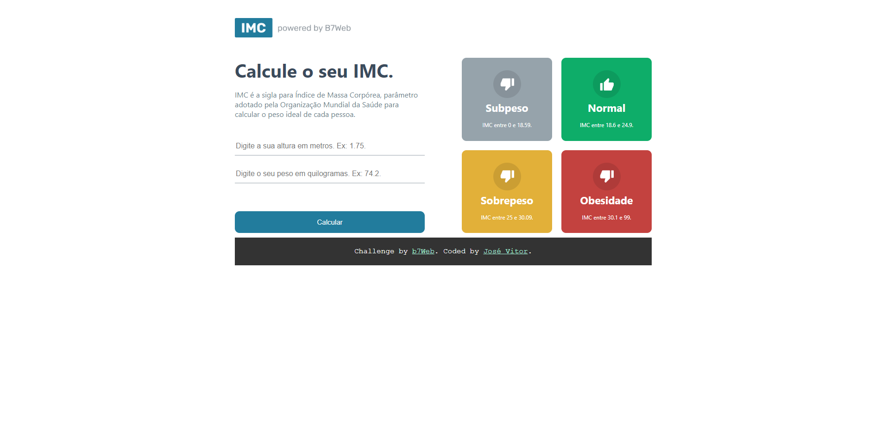

# Calculadora de IMC

## Descrição

A Calculadora de Índice de Massa Corporal (IMC) é uma aplicação web desenvolvida para ajudar os usuários a calcular seu IMC com base em sua altura e peso. Ao fornecer os dados de altura e peso nos campos designados, a calculadora retorna o IMC do usuário. Além disso, ela fornece uma indicação da categoria de peso do usuário, como subpeso, normal, sobrepeso ou obesidade, com base nos padrões estabelecidos.

## Funcionalidades

* Campos para inserção de altura e peso.
* Botão de cálculo para calcular o IMC.
* Exibição do resultado do IMC.
* Indicação da categoria de peso do usuário.
* Informações sobre como interpretar o IMC e as diferentes categorias de peso.

## Tecnologias Utilizadas

* TypeScript
* HTML
* CSS
* JavaScript
* ReactJS (para componentização e manipulação do estado)
* Front-end (foco na interface do usuário)

## Imagens

### Calculadora de IMC

;

### Resultado IMC

;